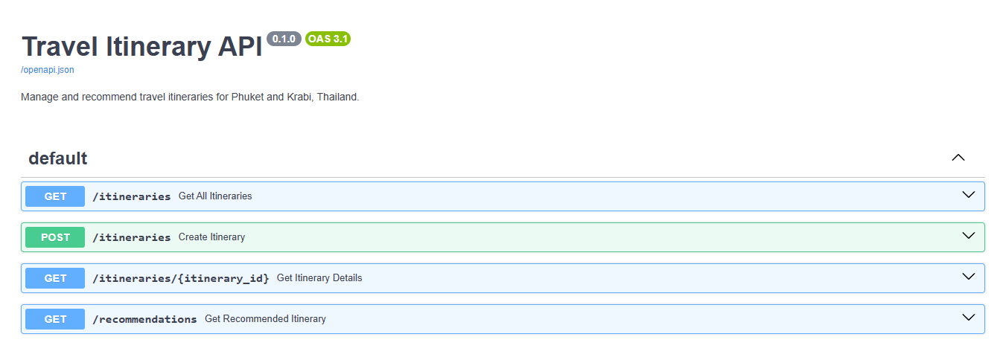
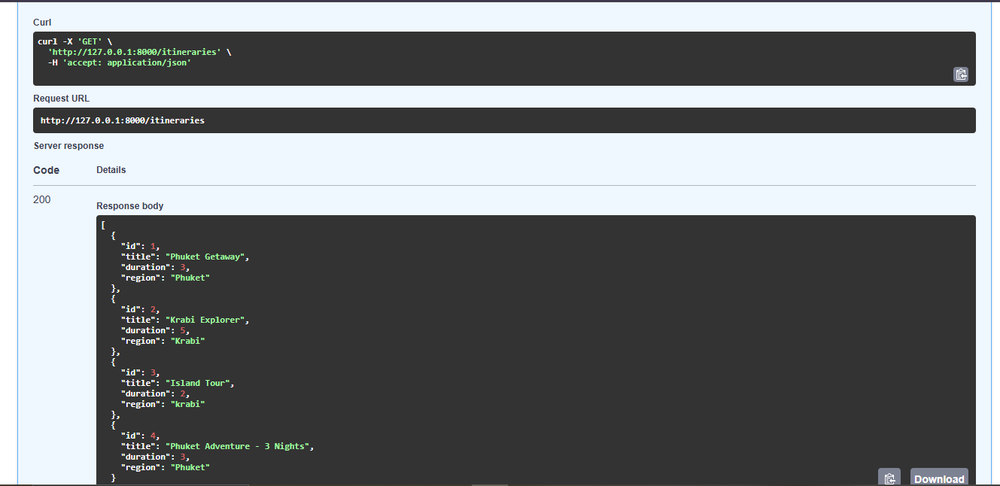
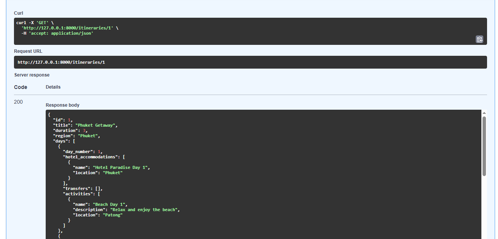
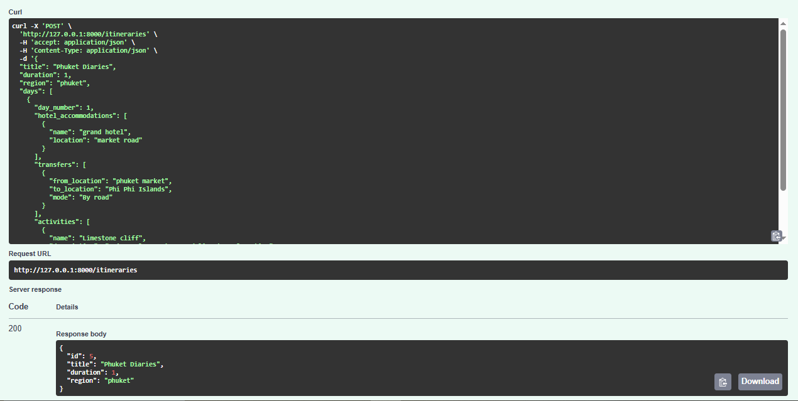
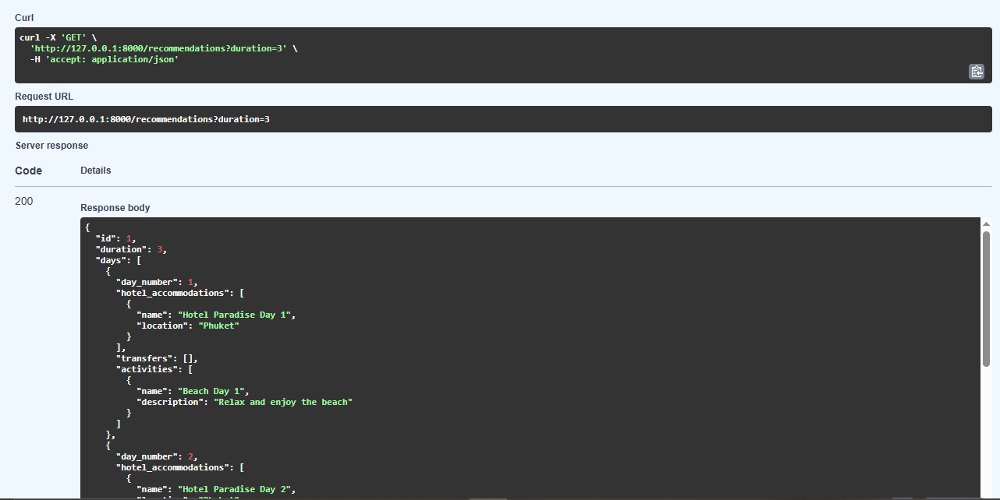

# 🌴 Travel Itinerary - FastAPI Project

This is a backend system for managing travel itineraries using **FastAPI** and **SQLAlchemy**, featuring RESTful APIs to create and view itineraries and an MCP server to recommend itineraries based on trip duration.

---

## 🚀 Live Demo

**🌐 Live URL:** [https://travel-itinerary-fdwd.onrender.com/docs](https://travel-itinerary-fdwd.onrender.com/docs)

---

## 🧰 Tech Stack

- **Python 3.11+**
- **FastAPI**
- **SQLAlchemy**
- **SQLite** (for development; switchable to PostgreSQL)
- **Uvicorn**
- **Render** (for deployment)
- **Pydantic** (for input validation)

---

## 📦 Features

- Create new itineraries with full day-wise breakdown
- View all stored itineraries
- MCP (Minimum Cost Path) server for recommending itineraries based on nights
- Pre-seeded data for **Phuket** and **Krabi**, Thailand
- Interactive Swagger UI for testing endpoints

---


## 📁 Folder Structure

```
travel-itinerary-backend/
│
├── app/                        # Main application package
│   ├── __init__.py            # Makes the app a Python package
│   ├── main.py                # Entry point of FastAPI app
│   ├── models.py              # SQLAlchemy models
│   ├── database.py            # DB connection setup
│   ├── schemas.py             # Pydantic schemas for validation
│   ├── seed_data.py           # Predefined itinerary data
│   └── routes/                # API route definitions
│       ├── itineraries.py       # CRUD routes for itineraries
│       
├── requirements.txt           # Project dependencies
├── README.md                  # Project documentation
├── .gitignore                 # Files to ignore in Git
└── start.sh                   # (Optional) Start script for deployment
```

---

## ⚙️ Features

- ✅ Create travel itineraries with hotel, transfer, and excursion data  
- ✅ Get recommended itineraries for 2 to 8-night durations  
- ✅ Modular code with FastAPI, SQLAlchemy, and SQLite  
- ✅ Auto-generated Swagger and ReDoc API docs  
- ✅ Deployed live using [Render](https://render.com)

---

## 🚀 Getting Started

### 📦 1. Clone the Repository

```bash
git clone https://github.com/ThasnimaShereef/Travel-Itinerary.git
cd Travel-Itinerary
```

### 🧪 2. Create a Virtual Environment

```bash
python -m venv venv
# For Windows:
venv\Scripts\activate
# For macOS/Linux:
source venv/bin/activate
```

### 📥 3. Install Dependencies

```bash
pip install -r requirements.txt
```

### ▶️ 4. Run the Development Server

```bash
uvicorn app.main:app --reload
```

Now visit: [http://127.0.0.1:8000/docs](http://127.0.0.1:8000/docs) for the Swagger UI.

---

## 🧪 API Endpoints

| Method | Endpoint                     | Description                           |
|--------|------------------------------|---------------------------------------|
| POST   | `/itineraries/`              | Create a new itinerary                |
| GET    | `/itineraries/`              | Get all itineraries                   |
| GET    | `/itineraries/{id}`          | Get itinerary by id                   |
| GET    | `/recommendations/{duration}`  | Get recommended itinerary by duration |

---

## 📸 Screenshots

### 📘 Swagger UI


### 🔍 Itinerary JSON Response for GET /itenararies - All Itenararies


### 🔍 Itinerary JSON Response for GET /itenararies/{id} - Itenarary based on id


### 🔍 Itinerary JSON Response for POST /itenararies - Creating a new itenarary


### 🔍 Itinerary JSON Response for GET /recommendations{duration} - Recommendation of itenararies based on the duration


---

## 🌍 Deployment on Render

### 🔁 1. Push to GitHub

```bash
git init
git remote add origin https://github.com/ThasnimaShereef/Travel-Itinerary.git
git add .
git commit -m "Initial backend commit"
git push -u origin main --force
```

### 🚀 2. Deploy via Render

- Go to [https://render.com](https://render.com)
- Create a **New Web Service**
- Connect your **GitHub repo**
- Set the **Build Command** to:
  ```bash
  pip install -r requirements.txt
  ```
- Set the **Start Command** to:
  ```bash
  uvicorn app.main:app --host 0.0.0.0 --port 10000
  ```
- Set **Port** to `10000`
- ✅ Deploy and wait for the live link!

---


